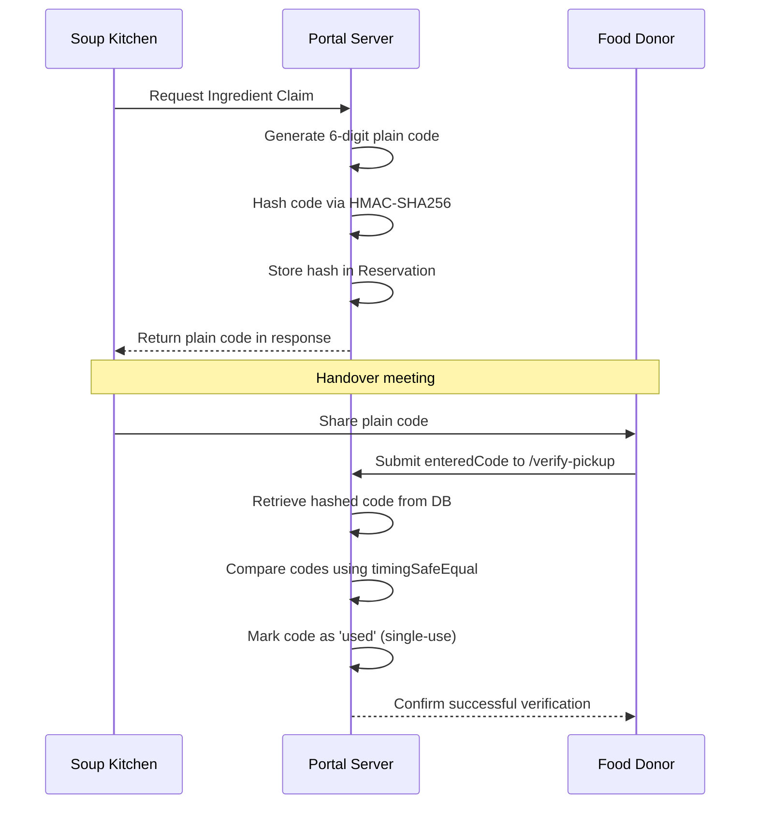

# Community Surplus Food Ingredient Inventory Routing Portal

A full-stack MERN (MongoDB, Express, React, Node.js) web application designed to coordinate the rescue and local redistribution of raw surplus food ingredients—focusing on fresh vegetables and perishable goods—from commercial donors (hotels, caterers, marriage/banquet halls, community halls) to local soup kitchens.

---

## 1. System Features & Workflows

*   **Donor-Controlled Uploads:** Donors list surplus raw ingredients specifying categories, quantities, storage conditions, and pickup deadlines.
*   **Indian Venue Categorization:** Tailored donor profiles for hotels, mandapams, marriage halls, community halls, restaurants, banquet halls, and catering facilities.
*   **Geospatial Search Feed:** Nearby community kitchens discover approved listings sorted nearest-first within a default 15 km radius limit.
*   **Route Support Map:** Interactive Leaflet maps with custom marker legends trace driving coordinates via a free same-origin OpenStreetMap (OSRM) API relay labeled **"Pickup Route Support"** (with straight-line fallback rendering if OSRM is offline).
*   **Atomic Claim Transactions:** Multi-document Mongoose database transactions prevent double claims or quantity race conditions.
*   **FEFO Pantry Intake:** Completed handovers automatically log ingredients into the kitchen's pantry batch inventory sorted by First-Expired, First-Out (FEFO) rules.
*   **Background Expiry Sweeper:** Periodically deactivates expired listings and triggers idempotent delay warnings for claimed listings without silent cancellations.
*   **Modern UI Customizations:** Clean, Vercel-style dark default and light theme variables featuring segmented tab navigation and high-contrast monospace numerical data displays.

---

## 2. System Requirements & Setup

### Environment Variables
Configure a `.env` file inside the `server/` directory:

```env
MONGODB_URI=mongodb://localhost:27017/community-food-portal
JWT_SECRET=your_jwt_signing_key_secret
PORT=5000
FRONTEND_URL=http://localhost:5173
PICKUP_CODE_SECRET=your_32_character_or_longer_secure_hmac_secret_key
```

> [!IMPORTANT]
> The `PICKUP_CODE_SECRET` is required and must be at least **32 characters** long. If missing or shorter, the server will fail-fast and terminate on startup.

---

## 3. Patented Secure Handover Protocol

To ensure custody tracking and prevent delivery fraud, pickup handovers require verification of a secure 6-digit confirmation key.



### Protocol Guarantees
*   **HMAC-SHA256 Hashing:** Plaintext codes are never stored in the database. Only HMAC-SHA256 hashes are persisted.
*   **Timing Attack Resistance:** Comparisons are made using `crypto.timingSafeEqual` over buffers.
*   **Failed Attempts Lockout:** Accounts are locked after 3 failed verification attempts. Use the `/regenerate-code` endpoint to generate a new code.
*   **Expiration Protection:** Codes expire after 15 minutes by default.
*   **Single-Use:** Once verified, the code is invalidated (`used`).

---

## 4. Development Validation Accounts

For automated testing and verification in development mode, populate the database with these idempotent seed credentials:

*   **Administrator:** `admin@surpluslink.local` / `ChangeMe2026!`
*   **Donor:** `donor@surpluslink.local` / `DonorDemo2026!`
*   **Kitchen:** `kitchen@surpluslink.local` / `KitchenDemo2026!`

---

## 5. Getting Started & Running Tests

### Start the Servers

1.  **Start Backend Express API:**
    ```bash
    cd server
    npm install
    npm start
    ```
2.  **Start Frontend Client (Vite):**
    ```bash
    cd client
    npm install
    npm run dev
    ```
    Access the portal at **`http://127.0.0.1:5173/`**.

### Database Seeding
To reset and seed the database with test accounts, categories, and ingredients:
```bash
cd server
node seed.js
```

### Run Verification Suite
To run all automated integration test suites:
```bash
cd server
node verify_all.js
```
